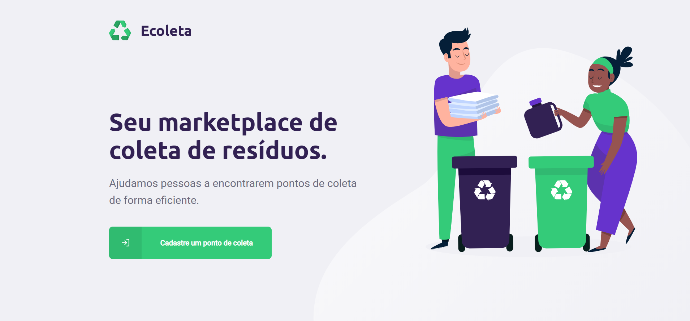
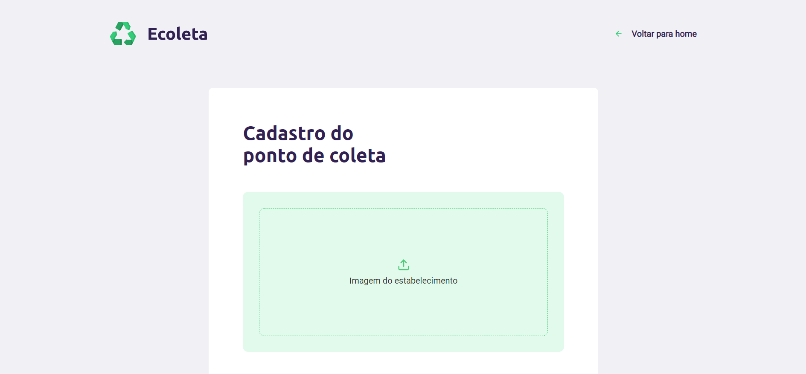
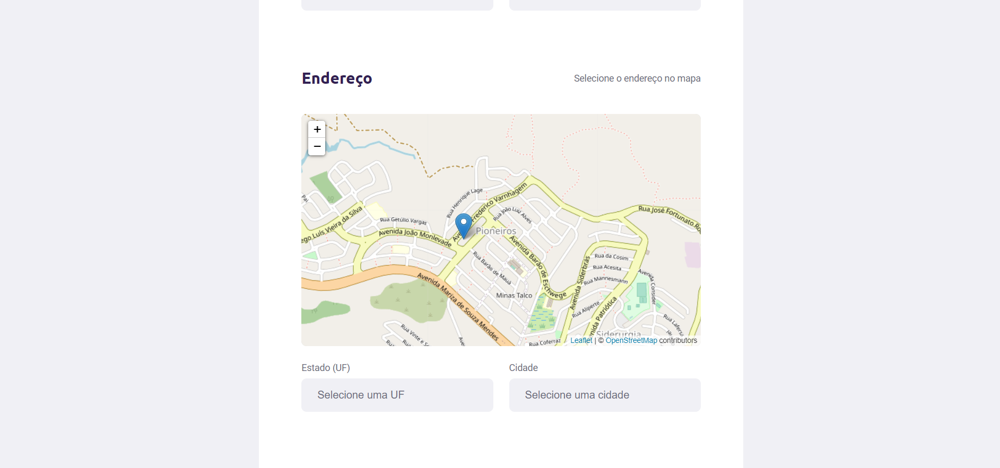
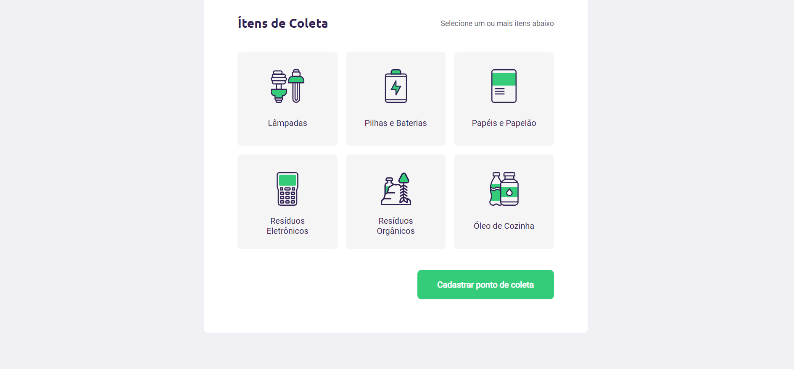
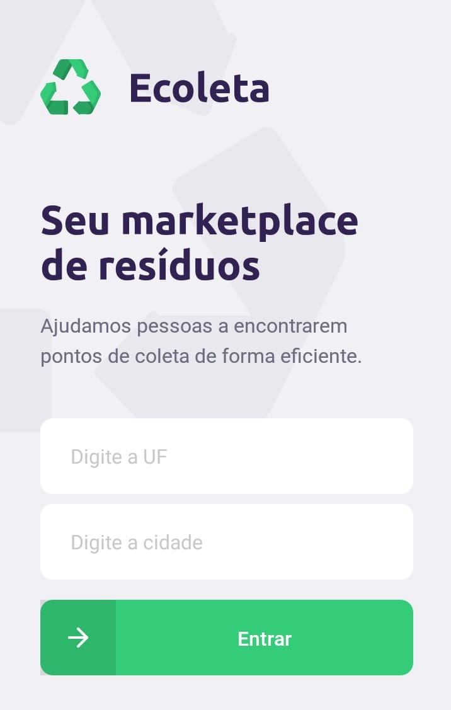
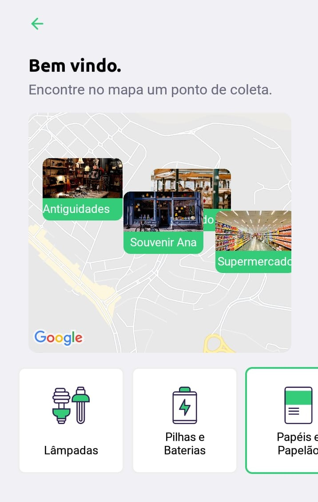
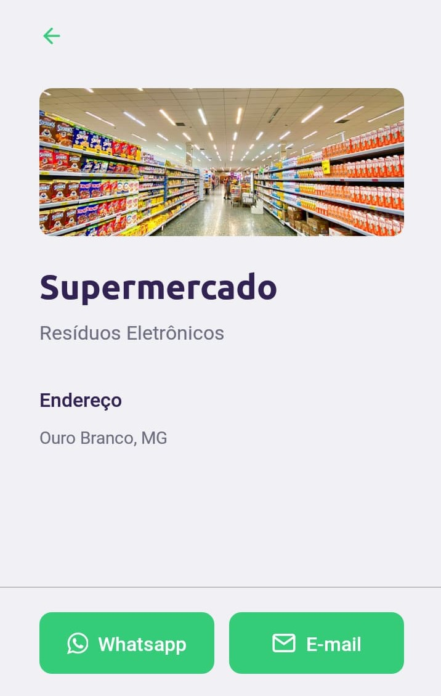

<h1 align="center">
    
</h1>

## 🎯 Projeto

Projeto desenvolvido durante a NLW - Next Level Week #01 organizado pela Rocketseat.

O tema do projeto gira em torno da Semana Internacional do Meio Ambiente e, possui como proposta fornecer um marketplace entre empresas/entidades que coletam resíduos, sejam eles orgânicos ou inorgânicos, à comunidade que precisa constantemente descartar esses tipos de materiais. Materiais estes, por exemplo: resíduos eletrônicos, pilhas e baterias, lâmpadas, entre outros. Assim, temos o descarte consciente e mais acessível à população.

<h1 align="center">
    
</h1>

## 🚀 Desenvolvimento
O projeto foi desenvolvido com as seguintes tecnologias: 
* Frontend (web): ReactJS
* Frontend (mobile): React Native
* Backend: NodeJS

## 📚 Tenologias Utilizadas

- Desenvolvimento utilizando TypeScript
- Construção de uma API RESTful
- Construção de páginas SPA
- Utilização de migrations, seeds e transações
- Utilização de mapa de código aberto - Leaflet
- Comunicação com APIs externas: IBGE - cidades e estados
- Localização do usuário
- Conexão com WhatsApp e Email
- Upload de imagens
- Validação de dados com Celebrate

## 💻 Aplicação Web

A aplicação web é voltada para as entidades e empresas cadastrarem seu ponto de coleta.

<h1 align="center">
    
    
    
    
</h1>

## 📱 Aplicação Mobile

A aplicação mobile é voltada para as pessoas fazerem consultas de quais locais fazem a coleta de acordo com a localização e materiais desejados.

<h1 align="center">
    
    
    
</h1>
